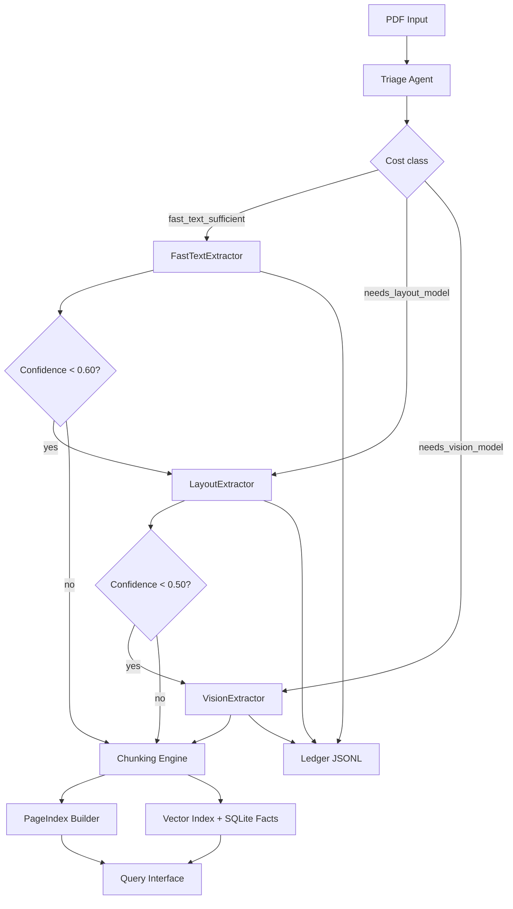

# DOMAIN_NOTES

## Extraction decision tree

1. Compute triage profile from PDF heuristics.
2. If `fast_text_sufficient`, run FastTextExtractor.
3. If confidence < 0.60 or profile says layout needed, escalate to LayoutExtractor (layout-lite fallback).
4. If confidence < 0.50 or profile says vision needed, attempt VisionExtractor.
5. If vision keys are absent, keep unresolved pages with low confidence while preserving provenance.

## Observed failure modes

- Multi-column legal docs where word order interleaves columns.
- Scanned pages with decorative backgrounds reduce OCR signal.
- Table borders absent; row grouping may degrade.
- Figures without captions become low-information chunks.

## Thresholds and rationale

- `char_count < 80` page is considered text-poor.
- `image_area_ratio > 0.75` and low density ⇒ scanned.
- `image_area_ratio > 0.20` and low density ⇒ mixed.
- `table_signal_ratio > 0.25` ⇒ table-heavy routing.
- Confidence floors:
  - fast floor: 0.60
  - vision escalation floor: 0.50

These prioritize cheap native text extraction first and escalate only when structure confidence drops.

## Pipeline diagram

