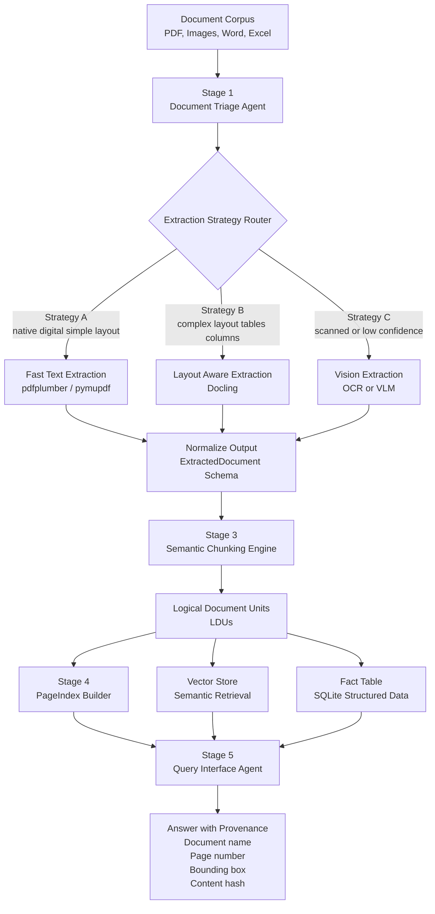

# The Document Intelligence Refinery

Local-first document extraction pipeline (PDF, DOCX, Markdown, images, XLSX) that preserves structure and provenance and supports confidence-gated escalation.

English behavior remains unchanged, with added multilingual support for English + Amharic.

## Pipeline stages (implemented)

1. **Triage Agent**
	- Produces `DocumentProfile` (`origin_type`, `layout_complexity`, `language_hint`, `domain_hint`, `estimated_extraction_cost`)
	- Stores profile at `.refinery/profiles/{doc_id}.json`

2. **Structure Extraction Layer (A/B/C)**
	- **A Fast Text**: native digital + single-column routing with confidence gate
	- **B Layout-Aware**: Docling (with layout enrichment fallback)
	- **C Vision-Augmented (local-first)**: Docling full-page OCR / Tesseract first, then unresolved fallback
	- Mandatory escalation guard: low-confidence A automatically retries with B

3. **Semantic Chunking Engine**
	- Emits `LogicalDocumentUnit` records with structural context (`parent_section`, `bounding_box`, relationships)
	- Enforces chunking constitution rules (table/header integrity, list boundaries, figure caption metadata)

4. **PageIndex Builder**
	- Builds hierarchical section tree (`title`, `page_start/end`, `child_sections`, `key_entities`, `summary`, `data_types_present`)
	- Supports section-first navigation before chunk retrieval

5. **Query Interface Agent (LangGraph)**
	- Tool graph with three tools:
	  - `pageindex_navigate` (tree traversal)
	  - `semantic_search` (vector retrieval)
	  - `structured_query` (SQL-like fact retrieval)
	- Always returns provenance records including `doc_name`, `page_number`, and `bbox`.
	- Falls back to linear orchestration automatically if LangGraph is not installed.

## Architecture Diagram



## Install

```bash
cd document-intelligence-refinery
python3.12 -m venv .venv
source .venv/bin/activate
pip install -e .[dev]
```

## Commands

```bash
refinery ingest data/*
refinery build-index data/*
refinery query --doc data/file.pdf "What is net profit?"
refinery query-interface --doc data/file.pdf "What are the capital expenditure projections for Q3?"
refinery audit --doc data/file.pdf "Revenue is $10M"
refinery show-pageindex --doc data/file.pdf
refinery open-citation --doc data/file.pdf --page 2 --bbox "50,100,300,180"
```

Supported file types:
- `.pdf`
- `.docx`
- `.md`
- `.png`, `.jpg`, `.jpeg`
- `.xlsx`

Language support matrix:
- PDF (digital): English + Amharic script detection
- PDF (scanned): OCR language routing (`eng`, `amh+eng`, fallback)
- DOCX: English + Amharic text preserved
- Markdown: English + Amharic text preserved
- Images: OCR-based, Amharic when language pack available
- XLSX: Unicode-safe cell extraction

## Provenance

Every chunk/fact carries:
- document name/id
- provenance `ref_type` and typed location fields
- deterministic `content_hash`

Provenance examples by type:
- PDF: `Page 3 | bbox [x0,y0,x1,y1]`
- Word: `Section: Financial Results > Revenue`
- Markdown: `Lines 42-57`
- Excel: `Sheet: Summary | Cells: B2:E10`
- Image: `Image bbox: [x0,y0,x1,y1]`

Extraction attempts are logged append-only in `.refinery/extraction_ledger.jsonl`.

Ledger rows also include:
- `detected_language`
- `ocr_lang_used` (when OCR paths are used)

## OCR setup (Ubuntu)

```bash
sudo apt-get update
sudo apt-get install -y tesseract-ocr tesseract-ocr-eng tesseract-ocr-amh
```

If Amharic pack is missing, the pipeline falls back to English OCR and records a fallback note.

## Environment examples

```bash
export REFINERY_OCR_ENABLED=true
export REFINERY_OCR_ENGINE=tesseract
export REFINERY_OCR_LANG_DEFAULT=eng
export REFINERY_OCR_LANG_FALLBACK=eng+amh
export REFINERY_OCR_AMHARIC_ENABLED=true
export REFINERY_LANGUAGE_DETECTION_MODE=script
export REFINERY_MULTILINGUAL_EMBEDDINGS=true
export REFINERY_EMBEDDING_MODEL=multilingual-lexical

# Strategy C (Vision) behavior
# Local-first by default; OpenRouter is opt-in only.
export REFINERY_USE_OPENROUTER_VLM=false
export REFINERY_VLM_PROVIDER=openrouter
export REFINERY_VLM_MODEL_LOW_COST=openai/gpt-4o-mini
export REFINERY_VLM_MODEL_HIGH_QUALITY=google/gemini-2.0-flash-001
# Only needed if REFINERY_USE_OPENROUTER_VLM=true
export REFINERY_OPENROUTER_API_KEY=your_key_here

# Stage 5 Query Agent (LangGraph)
export REFINERY_QUERY_USE_LANGGRAPH=true
export REFINERY_QUERY_SEMANTIC_TOP_K=5
```

Install LangGraph support:

```bash
pip install -e .[agent]
```

## Stage 5 Query Agent

Stage 5 runs a LangGraph orchestration with three tools:
- `pageindex_navigate` for section-first traversal
- `semantic_search` for chunk retrieval
- `structured_query` for SQL-style fact lookups

The query agent always returns provenance records with `doc_name`, `page_number`, and `bbox`.

Environment variables:

```bash
export REFINERY_QUERY_USE_LANGGRAPH=true
export REFINERY_QUERY_SEMANTIC_TOP_K=5
```

Example Stage 5 commands:

```bash
refinery query-interface --doc data/file.pdf "What are the capital expenditure projections for Q3?"
refinery query-interface --doc data/file.pdf "SELECT key, value, page_number FROM facts WHERE key LIKE '%Revenue%' LIMIT 5"
```

## Smoke E2E

Run the end-to-end smoke script:

```bash
.venv/bin/python scripts/smoke_e2e.py data/file.pdf
```

Optional custom question:

```bash
.venv/bin/python scripts/smoke_e2e.py data/file.pdf --question "What are the capital expenditure projections for Q3?"
```

The script prints:
- selected strategy
- ledger entry path
- top PageIndex sections
- top retrieved chunk ids
- final answer + provenance (`doc`, `page`, `bbox`)

## Common failure modes

- Missing `tesseract-ocr-amh` language pack → fallback to `eng`
- Very low OCR confidence on noisy scans
- Mixed-script lines can produce `unknown` language hint when sparse text

## Demo protocol (steps 1-4)

```bash
bash scripts/demo_protocol.sh
```

The demo performs triage, extraction, chunking/indexing, query, and prints provenance chains.
