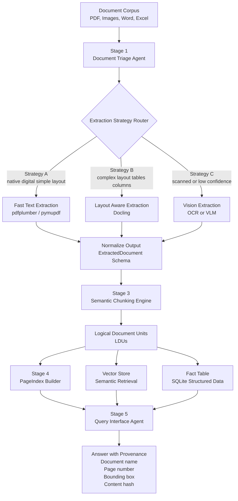

# The Document Intelligence Refinery

Local-first document extraction pipeline (PDF, DOCX, Markdown, images, XLSX) that preserves structure and provenance and supports confidence-gated escalation.

English behavior remains unchanged, with added multilingual support for English + Amharic.

## Pipeline stages (implemented)

1. **Triage Agent**
	- Produces `DocumentProfile` (`origin_type`, `layout_complexity`, `language_hint`, `domain_hint`, `estimated_extraction_cost`)
	- Stores profile at `.refinery/profiles/{doc_id}.json`

2. **Structure Extraction Layer (A/B/C)**
	- **A Fast Text**: native digital + single-column routing with confidence gate
	- **B Layout-Aware**: Docling (with layout enrichment fallback)
	- **C Vision-Augmented (local-first)**: Docling full-page OCR / Tesseract first, then unresolved fallback
	- Mandatory escalation guard: low-confidence A automatically retries with B

### Confidence formulas and thresholds

Routing and scoring are deterministic and rule-driven.

- Profile base confidence:
	- `base = 0.9 - 0.5*image_area_ratio - 0.2*whitespace_ratio`
	- Cost penalties: `-0.25` for `needs_vision_model`, `-0.10` for `needs_layout_model`
	- Clamp: `[0.05, 0.99]`
- Strategy A (Fast Text) document confidence:
	- `fast_conf = min(base, 0.30 + 0.70*pass_ratio)` then clamped to `[0.05, 0.99]`
	- `pass_ratio = pages_passing_fast_gate / total_pages`
	- Fast page gate uses:
		- `fast_min_chars_per_page` (default `100`)
		- `fast_max_image_area_ratio` (default `0.50`)
- Strategy B (Layout):
	- `layout_conf = min(0.95, base + 0.12)`
- OCR quality score (per scanned page): multiplicative penalties applied to `1.0`
	- if `ocr_word_conf_mean < 60` => `*0.7`
	- if `ocr_word_conf_p10 < 30` => `*0.8`
	- if `garbage_ratio > 0.25` => `*0.7`
	- if `avg_word_len < 3.0` => `*0.85`
	- if `token_diversity < 0.25` => `*0.85`
	- if origin is scanned => additional `*0.9`
	- Clamp: `[0.05, 0.95]`

Escalation thresholds (from `extraction_rules.yaml`):
- `fast_confidence_floor` default `0.60` (A -> B)
- `layout_confidence_floor` default `0.72` (B -> C)
- `escalate_to_vision_floor` default `0.50` (force C)
- Handwriting heuristic defaults:
	- `handwriting_whitespace_threshold=0.92`
	- `handwriting_char_density_threshold=0.00005`
	- `handwriting_image_ratio_threshold=0.55`

### Per-element confidence signals

Every extracted structure element now carries both:
- scalar `confidence` (existing normalized score in `[0,1]`), and
- `confidence_signals[]` (new granular evidence list).

Signal schema (`ConfidenceSignal`):
- `signal`: signal name
- `value`: raw metric value
- `normalized_value`: normalized metric in `[0,1]` when available
- `weight`: optional contribution weight
- `threshold`: optional gate threshold
- `passed`: optional boolean gate outcome

This applies to:
- `TextBlock`
- `TableObject`
- `FigureObject`

3. **Semantic Chunking Engine**
	- Emits `LogicalDocumentUnit` records with structural context (`parent_section`, `bounding_box`, relationships)
	- Enforces chunking constitution rules (table/header integrity, list boundaries, figure caption metadata)

4. **PageIndex Builder**
	- Builds hierarchical section tree (`title`, `page_start/end`, `child_sections`, `key_entities`, `summary`, `data_types_present`)
	- Supports section-first navigation before chunk retrieval

5. **Query Interface Agent (LangGraph)**
	- Tool graph with three tools:
	  - `pageindex_navigate` (tree traversal)
	  - `semantic_search` (vector retrieval)
	  - `structured_query` (SQL-like fact retrieval)
	- Always returns provenance records including `doc_name`, `page_number`, and `bbox`.
	- Falls back to linear orchestration automatically if LangGraph is not installed.

## Architecture Diagram



## Install

```bash
cd document-intelligence-refinery
python3.12 -m venv .venv
source .venv/bin/activate
pip install -e .[dev]
```

## Commands

```bash
refinery ingest data/*
refinery build-index data/*
refinery query --doc data/file.pdf "What is net profit?"
refinery query-interface --doc data/file.pdf "What are the capital expenditure projections for Q3?"
refinery audit --doc data/file.pdf "Revenue is $10M"
refinery show-pageindex --doc data/file.pdf
refinery open-citation --doc data/file.pdf --page 2 --bbox "50,100,300,180"
```

Supported file types:
- `.pdf`
- `.docx`
- `.md`
- `.png`, `.jpg`, `.jpeg`
- `.xlsx`

Language support matrix:
- PDF (digital): English + Amharic script detection
- PDF (scanned): OCR language routing (`eng`, `amh+eng`, fallback)
- DOCX: English + Amharic text preserved
- Markdown: English + Amharic text preserved
- Images: OCR-based, Amharic when language pack available
- XLSX: Unicode-safe cell extraction

## Provenance

Every chunk/fact carries:
- document name/id
- provenance `ref_type` and typed location fields
- deterministic `content_hash`

## Core Pydantic Schema Design

The core models use explicit Pydantic constraints and validators to enforce provenance integrity:

- `BBox` is a dedicated model (not a tuple alias), with sanity checks:
	- non-negative coordinates
	- strict geometry ordering (`x1 > x0`, `y1 > y0`)
- `ProvenanceRef` validates reference-specific payloads:
	- `pdf_bbox` / `image_bbox` require `bbox`
	- `word_section` requires `section_path`
	- `markdown_lines` requires valid `line_range` (`start >= 1`, `end >= start`)
	- `excel_cells` requires both `sheet_name` and `cell_range`
- Page/range semantics are constrained in schema:
	- `page_number >= 1`
	- `SectionNode.page_end >= page_start`
	- confidence and ratio fields bounded to `[0,1]` where appropriate

### Chain-level provenance

When an LDU aggregates multiple source references, chain-level provenance is represented explicitly with `ProvenanceChain`:

- `chain_type="single_source"` for one-step evidence
- `chain_type="aggregated"` for multi-reference aggregation
- `chain_type="multi_hop"` for explicit multi-hop reasoning chains

`LogicalDocumentUnit` stores both:

- `page_refs` (flat references for compatibility)
- `provenance_chain` (explicit chain semantics)

`QueryAnswer` also uses `provenance_chain` as a first-class structure.

Provenance examples by type:
- PDF: `Page 3 | bbox [x0,y0,x1,y1]`
- Word: `Section: Financial Results > Revenue`
- Markdown: `Lines 42-57`
- Excel: `Sheet: Summary | Cells: B2:E10`
- Image: `Image bbox: [x0,y0,x1,y1]`

Extraction attempts are logged append-only in `.refinery/extraction_ledger.jsonl`.

Ledger rows also include:
- `detected_language`
- `ocr_lang_used` (when OCR paths are used)

## Extraction Ledger

Each processed document writes one extraction ledger row in `.refinery/extraction_ledger.jsonl`.

Ledger entries include:
- strategy selection (`strategy_used`, `escalations`)
- extraction quality (`confidence_score`, `cost_estimate`, `processing_time_ms`)
- document characteristics (`origin_type`, `layout_complexity`, `detected_language`)
- extracted structure counts (`pages_processed`, `blocks_extracted`, `tables_extracted`)
- extraction context (`notes`, including OCR/docling and handwriting signals when available)

Strategy naming convention:
- Strategy A – Fast text extraction: `strategy_a_fast_text`
- Strategy B – Layout-aware extraction with Docling: `strategy_b_layout_docling`
- Strategy C – Local OCR extraction: `strategy_c_local_ocr`

Legacy labels such as `vision_disabled` may still appear in older historical logs.

Current ledger schema shape:
- `timestamp`
- `doc_id`
- `origin_type`
- `layout_complexity`
- `strategy_used`
- `confidence_score`
- `cost_estimate`
- `processing_time_ms`
- `pages_processed`
- `blocks_extracted`
- `tables_extracted`
- `escalations`
- `notes`
- `detected_language`
- `ocr_lang_used`

## OCR setup (Ubuntu)

```bash
sudo apt-get update
sudo apt-get install -y tesseract-ocr tesseract-ocr-eng tesseract-ocr-amh
```

If Amharic pack is missing, the pipeline falls back to English OCR and records a fallback note.

## Environment examples

```bash
export REFINERY_OCR_ENABLED=true
export REFINERY_OCR_ENGINE=tesseract
export REFINERY_OCR_LANG_DEFAULT=eng
export REFINERY_OCR_LANG_FALLBACK=eng+amh
export REFINERY_OCR_AMHARIC_ENABLED=true
export REFINERY_LANGUAGE_DETECTION_MODE=script
export REFINERY_MULTILINGUAL_EMBEDDINGS=true
export REFINERY_EMBEDDING_MODEL=multilingual-lexical

# Strategy C (Vision) behavior
# Local-only OCR/Docling strategy.
export REFINERY_LAYOUT_ENGINE=default
export REFINERY_RUNTIME_RULES_FILE=extraction_rules.yaml

# Stage 5 Query Agent (LangGraph)
export REFINERY_QUERY_USE_LANGGRAPH=true
export REFINERY_QUERY_SEMANTIC_TOP_K=5
```
### cpu and gpu usage 
Stage CPU/GPU Map

Stage 1 Triage (triage.py): CPU (pdfplumber, fitz, heuristics).
Stage 2A Fast Text (extraction.py): CPU.
Stage 2B Layout (Docling adapter) (__init__.py, extraction.py): Mostly CPU now, can be GPU-capable depending on Docling internals/env.
Stage 2C Vision local OCR (extraction.py:679): CPU now (Tesseract path).
Stage 3 Chunking (chunking.py): CPU.
Stage 4 PageIndex build (pageindex.py): tree logic is CPU; optional Ollama summaries use GPU if Ollama model is GPU-loaded.
Stage 5 Query agent (query.py, vector_store.py): retrieval/ranking is CPU; optional Ollama answer synthesis can use GPU.

### Extensibility hooks

Extraction internals expose pluggable hooks while preserving normalized output schema (`ExtractedDocument`, bounded confidence fields, provenance guarantees):

- Layout engines:
	- Register with `ExtractionRouter.register_layout_engine(name, engine_fn)`
	- Select at runtime with `REFINERY_LAYOUT_ENGINE`
	- Engine contract: `(pdf_path, profile) -> (ExtractedDocument, confidence, cost, notes, strategy_name)`

Default behavior remains unchanged (`default` layout engine).

Install LangGraph support:

```bash
pip install -e .[agent]
```

## Stage 5 Query Agent

Stage 5 runs a LangGraph orchestration with three tools:
- `pageindex_navigate` for section-first traversal
- `semantic_search` for chunk retrieval
- `structured_query` for SQL-style fact lookups

The query agent always returns provenance records with `doc_name`, `page_number`, and `bbox`.

Environment variables:

```bash
export REFINERY_QUERY_USE_LANGGRAPH=true
export REFINERY_QUERY_SEMANTIC_TOP_K=5
```

Example Stage 5 commands:

```bash
refinery query-interface --doc data/file.pdf "What are the capital expenditure projections for Q3?"
refinery query-interface --doc data/file.pdf "SELECT key, value, page_number FROM facts WHERE key LIKE '%Revenue%' LIMIT 5"
```

## Triage Configuration

Triage classification thresholds are fully configurable via `REFINERY_` environment variables.

Key knobs:
- `REFINERY_TRIAGE_LOW_CHAR_PAGE_THRESHOLD`
- `REFINERY_TRIAGE_FORM_FILLABLE_MIN_FIELDS`
- `REFINERY_TRIAGE_SCANNED_IMAGE_MIN_IMAGE_RATIO`
- `REFINERY_TRIAGE_SCANNED_IMAGE_MAX_CHAR_DENSITY`
- `REFINERY_TRIAGE_MIXED_MIN_IMAGE_RATIO`
- `REFINERY_TRIAGE_MIXED_MAX_CHAR_DENSITY`
- `REFINERY_TRIAGE_MIXED_MODE_PAGES_FRACTION_THRESHOLD`
- `REFINERY_TRIAGE_TABLE_HEAVY_RATIO`
- `REFINERY_TRIAGE_FIGURE_HEAVY_IMAGE_RATIO`
- `REFINERY_TRIAGE_MULTI_COLUMN_MIN_COLUMNS`
- `REFINERY_TRIAGE_MULTI_COLUMN_FRACTION`
- `REFINERY_TRIAGE_LAYOUT_MIXED_SIGNAL_COUNT`
- `REFINERY_TRIAGE_VISION_MAX_CHAR_DENSITY`
- `REFINERY_TRIAGE_VISION_MIN_IMAGE_RATIO`
- `REFINERY_TRIAGE_LAYOUT_LOW_CHAR_PAGES_FRACTION`

Notes:
- Zero-text documents are handled explicitly and produce conservative language/domain confidence.
- Mixed-mode page evidence is modeled via per-page text+image signals and can drive `origin_type="mixed"`.
- Domain classification is pluggable (`DomainClassifier` interface), so classifier strategy can be swapped without changing triage core logic.

## Runtime Rules Configuration

`extraction_rules.yaml` now controls runtime behavior for:

- extraction confidence/escalation thresholds (`extraction.*`)
- chunking rules and regex behavior (`chunking.*`)
- non-PDF origin/layout/cost profile mapping (`file_type_profiles.*`)
- domain keyword lists used by triage (`triage.domain_keywords.*`)
- fact extraction key lists and Amharic keyword source (`facts.*`)

Onboarding a new domain can be done without Python changes by updating `triage.domain_keywords`, tuning `file_type_profiles`, and adjusting thresholds in `extraction_rules.yaml` and/or `REFINERY_*` environment variables.

## Smoke E2E

Run the end-to-end smoke script:

```bash
.venv/bin/python scripts/smoke_e2e.py data/file.pdf
```

Optional custom question:

```bash
.venv/bin/python scripts/smoke_e2e.py data/file.pdf --question "What are the capital expenditure projections for Q3?"
```

The script prints:
- selected strategy
- ledger entry path
- top PageIndex sections
- top retrieved chunk ids
- final answer + provenance (`doc`, `page`, `bbox`)

## Pipeline Validator

Run the strict stage-by-stage validator:

```bash
.venv/bin/python scripts/validate_e2e.py data/file.pdf
```

Optional custom question for Stage 5 validation:

```bash
.venv/bin/python scripts/validate_e2e.py data/file.pdf --question "What are the capital expenditure projections for Q3?"
```

Validation behavior:
- Fail-fast with explicit stage output: `FAILURE: <STAGE_NAME>`
- Stage 3 checks chunk schema (`ldu_id`, `chunk_type`, `token_count`, `page_refs`, `content_hash`) and non-empty chunk output
- Stage 5 checks answer/tool trace plus provenance chain structure (`doc_name`, `page_number`, `bbox`)
- Uses `doc_id` consistently after ingest; `query-interface` is validated with `--doc <doc_id>`

## Common failure modes

- Missing `tesseract-ocr-amh` language pack → fallback to `eng`
- Very low OCR confidence on noisy scans
- Mixed-script lines can produce `unknown` language hint when sparse text

## Demo protocol (steps 1-4)

```bash
bash scripts/demo_protocol.sh
```

The demo performs triage, extraction, chunking/indexing, query, and prints provenance chains.
